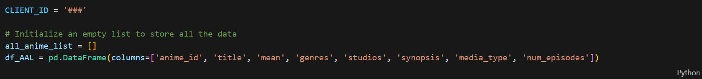
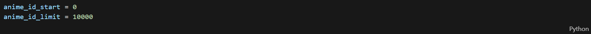
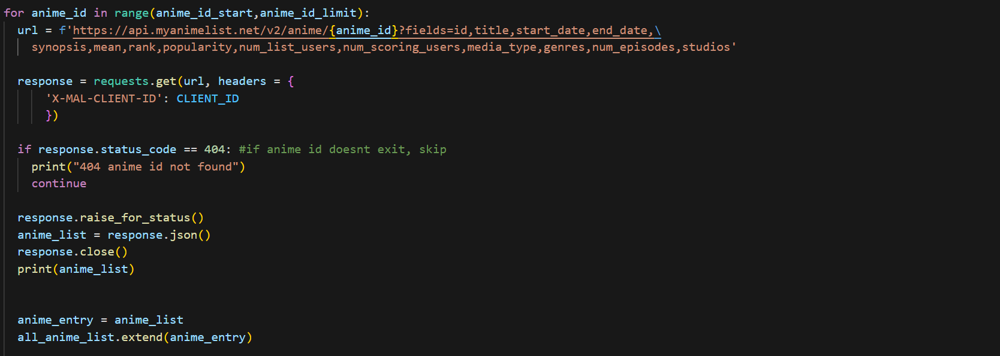
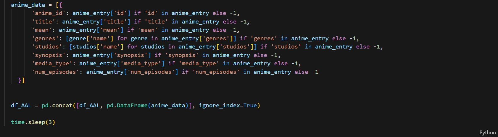
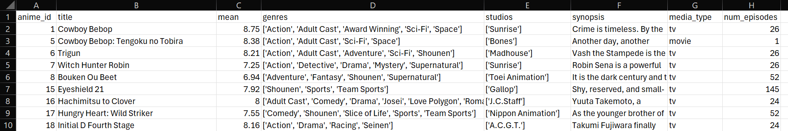

# 📌 Project Background  
Over the past few decades, Japanese animation, also known as anime, has successfully emerged as one of the most influential and rapidly growing entertainment industries globally. This global phenomenon has captivated audiences of all ages and backgrounds from classics like <i>One Piece</i> and <i>Naruto</i> to newcomers like <i>Attack on Titan</i> and <i>Jujutsu Kaisen</i>. Anime is growing from streaming platforms, gaming, merchandise, live-action films, and conventions. This remarkable growth has led to a surge of online communities dedicated to this art form.  

This project focused on analyzing data on anime and viewer preferences to create a recommendation system for viewers. We used data from MyAnimeList (MAL), one of the largest anime community-driven platforms that allows users to track, rate, and review anime and manga titles. There are anime-related datasets on Kaggle. However, most of those datasets have not been updated for over 5 years. So for this project, we retrieved the data by using the MyAnimeList API to ensure that we have a more current and comprehensive perspective of our analysis, accounting for the latest developments within the anime community.    

<i>In collaboration with Yilu Chen, Andrew Gatchalian, Hsuan-Yi Lin, and Rakesh Venkata Subramaniyan.</i>  

# ⚡Data Retrieval  
Our strategy was to first extract the data of users and animes from MyAnimeList and store the data in a data frame that contained a list of the animes and the user ratings.  
1. Each team member created an account on MAL and obtained a unique client ID to use the OAuth 2.0 protocol to authenticate tokens and access the data.  
    
      
      
3. Using the same Python code, each team member was allocated a segment of 10,000 anime IDs.  
   Throughout the process, the API encountered 403 and 404 errors. A 403 error occurs when calls are made too frequently. To mitigate this issue, we added a 3-second delay in the code enabling us to circumvent encountering this problem. A 404 error is a "not found" error. For this issue, we added a conditional statement to skip the anime ID.  
    
      
    
    
      
    
    
      
      
5. Each member exported his/her data to a CSV file and placed it into a shared file. All the individual files were consolidated to create a master file that contained approximately 50,000 anime titles and their user rating. Below is an example of what the data file looked like:  
    
      
      
7.  

