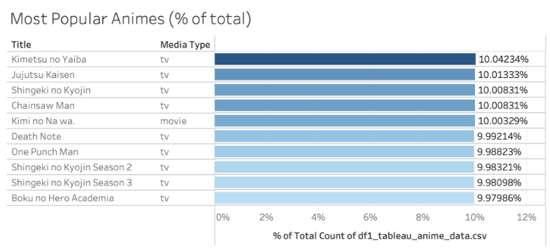

# 📌 Project Background  
Over the past few decades, Japanese animation, also known as anime, has successfully emerged as one of the most influential and rapidly growing entertainment industries globally. This global phenomenon has captivated audiences of all ages and backgrounds from classics like <i>One Piece</i> and <i>Naruto</i> to newcomers like <i>Attack on Titan</i> and <i>Jujutsu Kaisen</i>. Anime is growing from streaming platforms, gaming, merchandise, live-action films, and conventions. This remarkable growth has led to a surge of online communities dedicated to this art form.  

This project focused on analyzing data on anime and viewer preferences to create a recommendation system for viewers. We used data from MyAnimeList (MAL), one of the largest anime community-driven platforms that allows users to track, rate, and review anime and manga titles. There are anime-related datasets on Kaggle. However, most of those datasets have not been updated for over 5 years. So for this project, we retrieved the data by using the MyAnimeList API to ensure that we have a more current and comprehensive perspective of our analysis, accounting for the latest developments within the anime community.    

(Note: Please click on the screenshot to enlarge it.)  

<i>In collaboration with Yilu Chen, Andrew Gatchalian, Hsuan-Yi Lin, and Rakesh Venkata Subramaniyan.</i>  
 
# ⚡Data Retrieval  
Our strategy was to first extract the data of users and animes from MyAnimeList and store the data in a data frame that contained a list of the animes and the average user ratings.  
1. Each team member created an account on MAL and obtained a unique client ID to use the OAuth 2.0 protocol to authenticate tokens and access the data.    
    
      
      
3. Using the same Python code, each team member was allocated a segment of 10,000 anime IDs.  
   Throughout the process, the API encountered 403 and 404 errors. A 403 error occurs when calls are made too frequently. To mitigate this issue, we added a 3-second delay in the code enabling us to circumvent encountering this problem. A 404 error is a "not found" error. For this issue, we added a conditional statement to skip the anime ID.  
    
      
      
      
    
      
      
5. Each member exported his/her data to a CSV file and placed it into a shared file. All the individual files were consolidated to create a master file that contained 16,135 unique anime titles and their user rating. Below is an example of what the anime data file looked like.    
    
      
    
   
Since our project objective is to make anime recommendations based on users' ratings, our next task was to generate a user list. The MAL website contains 14 million users. However, using this list would result in excessive time consumption and storage requirements. Therefore, we made the strategic decision to employ a subset of these users, specifically the most recently active users. We utilized the BeautifulSoup library to navigate and extract information from the website.  
1. Each team member ran the code below, which used the provided URL to repeatedly generate a random list of 20 recent users upon each page refresh until a list of 50,000 unique usernames is retrieved.  
    
      
      
      
      
   By using the BeautifulSoup library, we were able to parse through the HTML content, targeting the sections where usernames were listed within the HTML structure. This process allowed us to collect as many usernames as required.  
2. Similar to the list of animes, each member exported his/her data to a CSV file and placed it into a shared file. All the individual files were consolidated to create a master file. Duplicate usernames were removed which resulted in approximately 18,145 unique users. Below is an example of what the users' data file looked like.    
    
      
    
   
With the two lists, one of the anime titles and one of the usernames, we used this data in conjunction with the MAL API to extract user ratings.  
1. First, we initialized a data frame to store the records and imported the CSV file of the usernames.       
    
      
      
      
      
3. Executed a loop to iterate through each of the usernames.
    
      
      
      
      
5. Then, we used the API to call on the rating lists for each user. This resulted in 44 million rows of data. Below is an example of what the anime user ratings data file looked like.  
    
      
      

# 🧽 Data Cleaning  
Extensive cleaning was undertaken before implementing our model to enhance the quality of our datasets.  
- Due to the size of the dataset, we had to process the initial data in subsets.
- We formatted the columns by removing the brackets and quotations that were included in the raw data.
- We replaced spaces with an underscore (_) to ensure readability.  
- We dropped duplicate rows and any missing values from our data.
- We created dummy variables for the studios and genre variables.
- For consistency, we made specific assumptions during the cleaning process. For example, since MAL tracks the progress of a user on a given anime, we opted to keep only the rows that were flagged as "Complete" or "Dropped". Additionally, we assumed that instances where the rating is 0 means that the anime was either not watched or the user simply forgot to rate the anime. Therefore, we removed any records with a rating of 0.
- The site tracks every instance of ratings that users place on anime titles, in other words, if a user rated a show multiple times, each instance would appear in the dataset. To address this discrepancy, we kept only the latest rating for each user-anime pair using the "updated_at" column which provides a timestamp of when each rating was made.

# 📊 Exploratory Data Analysis  
- The top 10 animes based on average user ratings (minimum of 1,000 ratings), we found that the year when the anime is released does not affect its popularity. As the table below shows, classic shows like <i>Gintama</i> (2015) and <i>One Piece</i> (1999) and newcomers such as <i>Shingeki no Kyojin</i> (2019) and <i>Sousou no Frieren</i> (2023) are equally highly rated.  
    
      
      
  However, a common characteristic between these highly rated shows is that they are ranked amongst the top 50 shows on MAL's website. In fact, by comparing the top 10 shows in our data to the mean aggregate scores on the website, we found that each score is relatively similar. This suggests that despite our data being limited, our dataset still manages to capture the essence of user preferences.  
- The most popular genres seemed to be comedy, kids, fantasy, action, and adventure. This makes sense since a large demographic of anime viewers are teens.  
    
      
      
  These tiles include popular titles, such as <i>Kimetsu no Yaiba</i> (2019), <i>Jujutsu Kaisen</i> (2020), and <i>Death Note</i> (2006).  
    
      
      
  The latest released show on this list is <i>Chainsaw Man</i> (2022). Although this anime is popular, it should also be noted that the method by which we collected this data (based on recent users) may influence how recently released shows are perceived.
- As we discussed in the Data Cleaning section, we opted to keep only shows that were flagged as "Completed" and "Dropped" as an indication that the user had some conscious familiarity with the show on his/her list. Therefore, we looked at the most completed and most dropped animes.  
    
      
      
  As expected, the most completed titles were some of the most popular animes in our data. Additionally, by comparing the average user score to the mean, we found consistency in the user ratings. On the other hand, the most dropped titles had extremely low ratings, even lower than the mean rating on the MAL website. This could be an indication that the users in our dataset have much stronger opinions about shows that dislike.

# 💻 Recommendation System Model  
We implemented the K-Nearest Neighbors (KNN) algorithm which is designed to predict instances based on the majority class or the average of its <i>k</i> nearest neighbors. For this project, KNN was used as a tool for personalized recommendations by leveraging the historical ratings of users on the MAL website. By targeting a specific anime, KNN identifies other titles with similar user ratings and recommends animes that are frequently rated highly by the nearest neighbors or the target anime. To create this model,   
1. First, we imported the cleaned data files and stored them in separate data frames.  
   - The file that contained the 44 million records of user-anime pairs was stored in a data frame called user_ratings.  
   - The list of anime titles was stored in a data frame called anime_data.
   - The file with the dummy variables for genre was stored in a data frame called knn_genres.      
3. Then, we created a matrix of the users and animes.  
    
      
      
4. Using the scikit-learn library, we initialized the nearest neighbors model.   
    
      
    
5. We experimented with Z-score normalization to improve our model's performance and incorporated genres as dummy variables to give us more subtle results.
6.    
  
